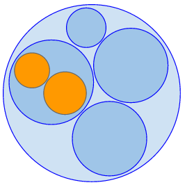

Bubblify
========

This script converts indented blocks of text for use with d3's hierarchical [circle packing visualization](http://mbostock.github.io/d3/talk/20111116/pack-hierarchy.html)


Requirements
-
* pyparsing: v1.5.7 for python2.\* \( **provided in repo** \), v2.0 for python3
```$ cd pyparsing-1.5.7/

$ sudo python setup.py install```


Usage
-

- ***Write indented text file***


- ***Bubblify***

` $ python Bubblify.py text-file `


- ***View in browser***

` $ python -m SimpleHTTPServer `

open url `localhost:8000`




