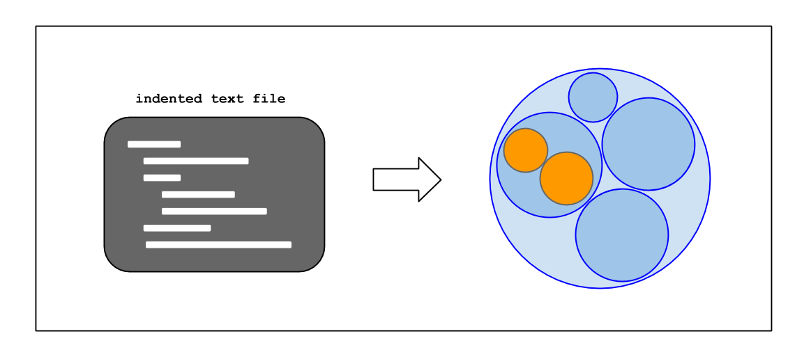

Bubblify
========

This script converts indented blocks of text for use with d3's hierarchical [circle packing visualization](http://mbostock.github.io/d3/talk/20111116/pack-hierarchy.html)


Requirements
-
* pyparsing: v1.5.7 for python2.\* \( **provided in repo** \), v2.0 for python3
    * `$ cd resources/pyparsing-1.5.7/`
    * `$ sudo python setup.py install`


Usage
-




``` 
// $ vim ideas                          # write indented text file
// $ python Bubblify.py ideas
// $ python -m SimpleHTTPServer
```
open localhost:8000 in browser


*file format:*
```
project name
  first thing
    something about first thing
    something else as well
  other thing
  last thing
```


Quirks
-
* can only have one top-level ("project-name" in example above)
* if a block has only one child element, the child bubble will fill the parent bubble
